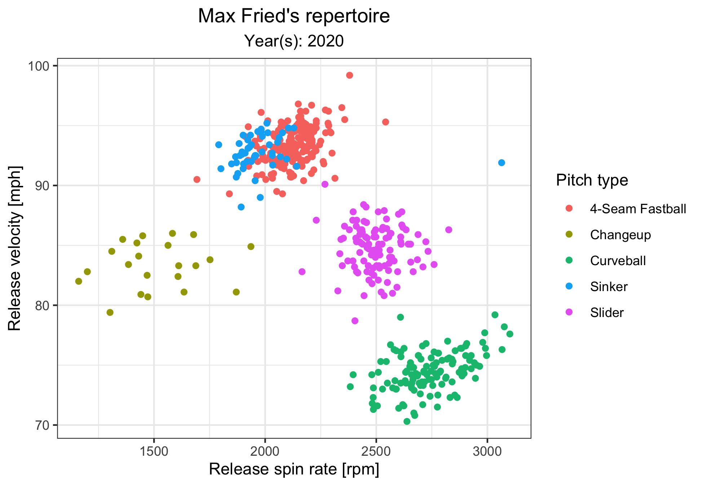
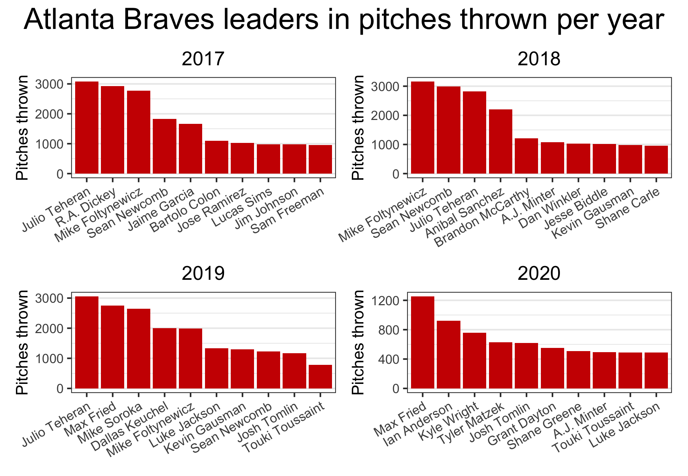
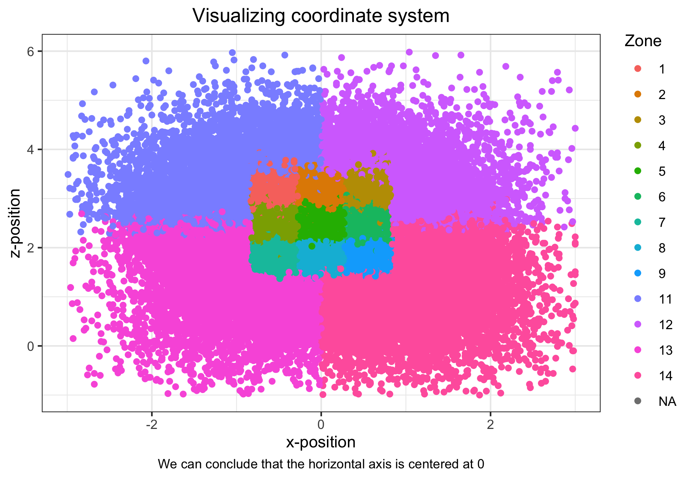
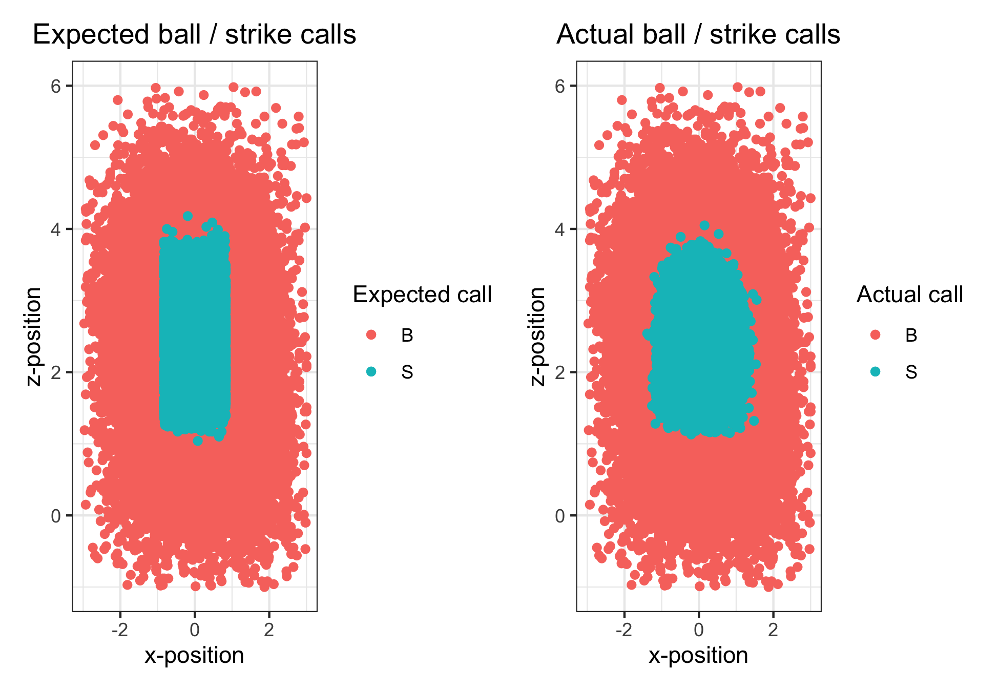

# Exploration of 2017 - 2020 Atlanta Braves Pitching Statcast Data

## Description

Since I donned my first tee ball jersey, baseball has been my favorite sport (and the Atlanta Braves, my favorite team). Given some free time during a COVID-19 induced, elongated winter break from my Master's program in Statistics at Duke, I decided to delve into some Statcast data to (1) keep my coding skills sharp and (2) learn a few interesting tid-bits about my favorite players.

I didn't enter this project with any specific objectives or research questions. Rather, I enjoyed exploring the data freely, posing questions that I encountered along the way, and synthesizing my findings (and potential next steps) at each stopping point.

In an attempt to limit the potential scope of my investigations (and keep the data to a manageable size), I used the following criteria for my initial data set:

- Atlanta Braves only
- Pitching data only
- 2017 - 2020 regular season and playoffs

The entirety of my analysis is accessible via the [Rmd](https://github.com/robkravec/Atlanta-Braves-Pitching/blob/main/Pitching_Analysis.Rmd) file in this repository, and I will also highlight a sample of my more visually appealing results below.

## Selected results

### Pitch classification

Major League Baseball (MLB) has a sophisticated neural network based software that intakes information about each pitch thrown in real-time and returns a pitch classification (e.g., fastball, curveball, slider). I was curious to see how well a simple gradient boosted model (e.g., no hyperparameter tuning, no feature engineering) would perform at this task when focused on one pitcher at a time. For a handfull of case studies, the validation classification accuracy was 96%+, which exceeded my expectations. That said, I recognize a number of challenges (in my Rmd file) that MLB faces on a regular basis, which likely makes their classification challenge much harder than the one that I performed.

The example plots below relate to Max Fried's 2020 season:

### Interactive plots of pitch movement

To gain practice with interactive plotting (through ggiraph), I generated interactive scatterplots of vertical movement vs. horizontal movement for both fastball-type pitches (i.e., 2-seam fastball, 4-seam fastball, cutter, sinker) and offspeed pitches (e.g., changeup, curveball, slider). Each point represents an average for a single pitcher from 2017 - 2020 (or at least the portion of that time that they spent with the Braves). 

Since the plots are saved as .html files and are not easily displayed in this README, I present a couple of screenshots and encourage any interested parties to clone this repo (or run my .Rmd file) to see the full plots.

### Braves pitching staff composition

Nothing fancy in this plot other than some simple use of the patchwork package for combining individual plots. I just wanted to visualize the change in composition of the Braves' pitching staff over time, and the level of turnover really is incredible!  

### Strike zone analysis

I really only scratched the surface with this strike zone analysis, but I was interested in how often MLB umpires make the correct ball / strike calls during games. Through my own exploratory analyses and some quick research of existing articles, I found that this question is quite complex. In practice, the strike zone is variable, depending on the handedness of the batter, the number of balls / strikes in the count, and several other factors. 

In this section, I simply present:

- An aesthetically appealing scatterplot of all pitches in the data set colored by "zone," which is a Statcast provided variable. The innermost rectangle is in the heart of the strike zone, the immediately surrounding rectangles are the edges of the strikezone, and the remaining four zones are far outside of the strike zone
- A comparison of the expected calls from an "objective strike zone" based on the width of home plate and the height of each batter's stance vs. the actual ball / strike calls. Clearly, there is quite a bit of difference!

## Future analysis wishlist

### EDA

- More in-depth analysis of strike zones (using strike zone related article in references and others 
available online as starting points)
- Pitch velocity over time for pitchers (during game, during season, year-to-year)
- In-depth scouting report on particular pitcher(s) of interest

### Visualization

- Plot the trajectory of a pitch (possibly creating mock-up strike zone and
MLB Gameday-type aesthetic)

### Modeling

- Predict which pitch will be thrown in certain situations

## References

- Data was obtained from [Baseball Savant Statcast search](https://baseballsavant.mlb.com/statcast_search). Results can be reproduced by selecting "Regular Season" and "Playoffs" under the "Season Type" filter, 2017-2020 under the "Season" filter, and "Braves" under the "Team" filter
- Two sources on working with XGBoost in R ([article 1](https://xgboost.readthedocs.io/en/latest/R-package/xgboostPresentation.html), [article2](https://towardsdatascience.com/getting-to-an-hyperparameter-tuned-xgboost-model-in-no-time-a9560f8eb54b))
- Thorough explanation of MLB's past and present use of pitch classification models ([link](https://technology.mlblogs.com/mlb-pitch-classification-64a1e32ee079))
- Example analysis of MLB strike zones ([link](https://blogs.fangraphs.com/the-size-of-the-strike-zone-by-count/))
